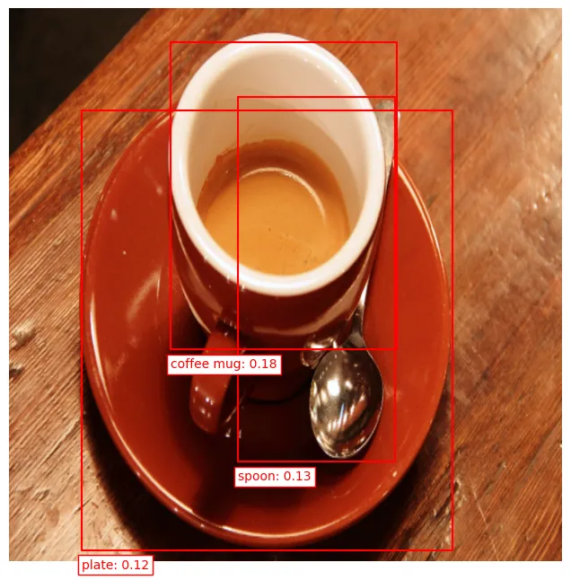
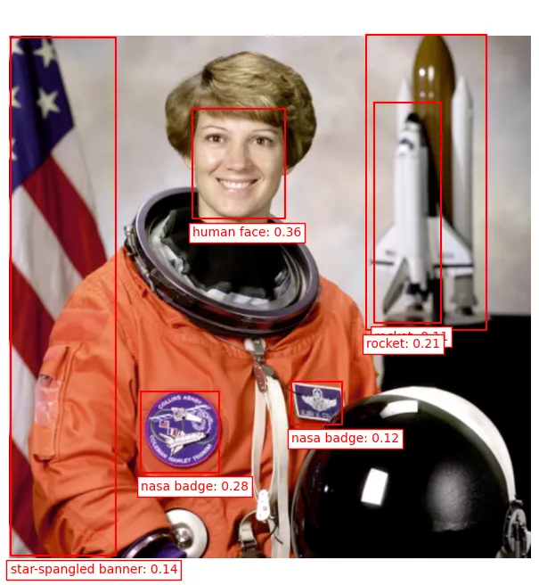
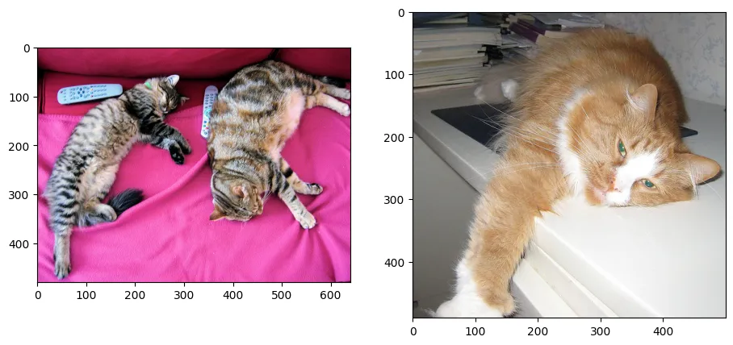
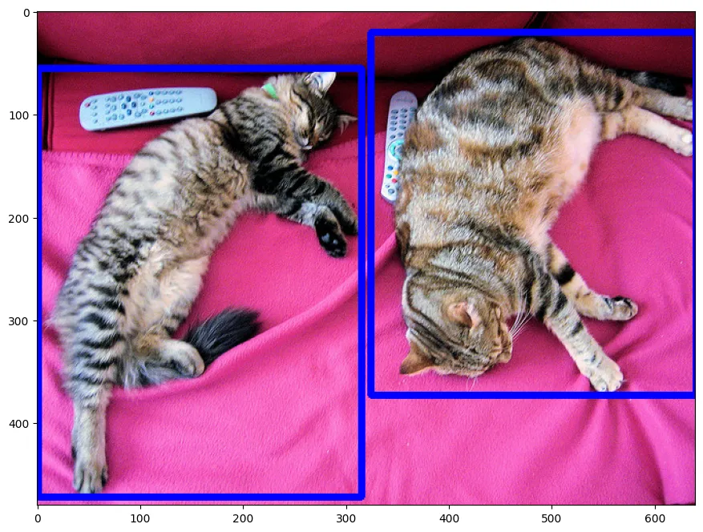
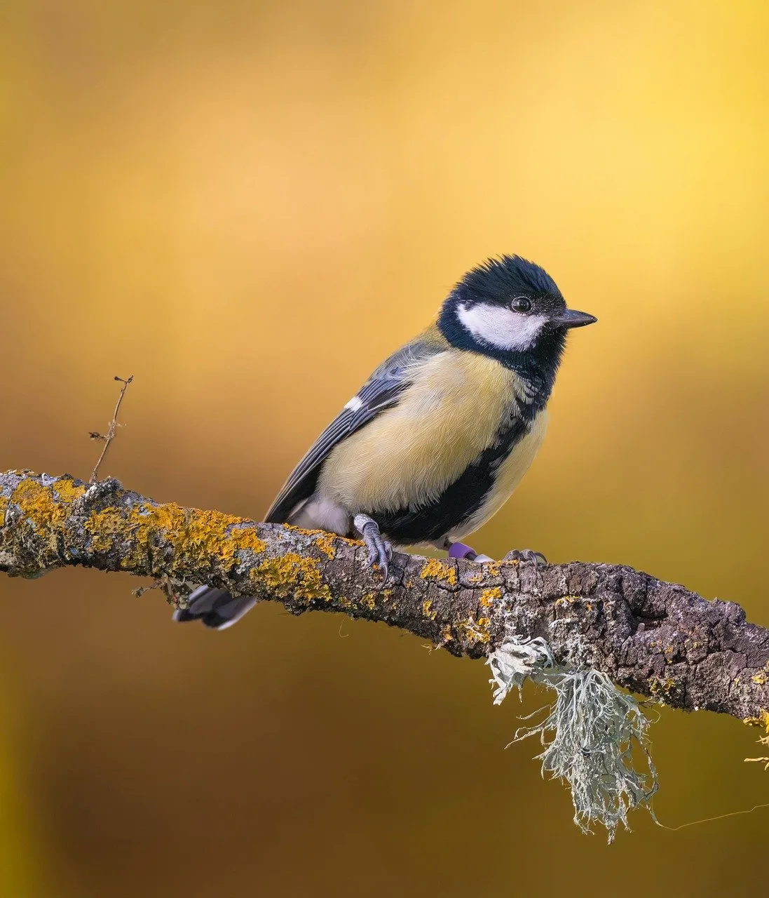
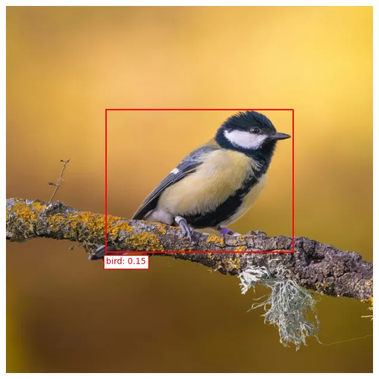
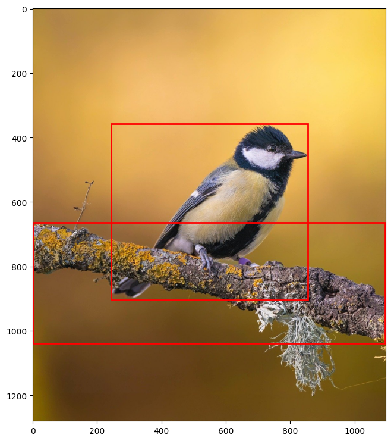

Benchmarking des modèles de détection d'objets
==============================================

Introduction
------------

Dans le cadre du développement de **Segma Vision Pro Synchronizer**, nous avons mené une évaluation comparative de deux modèles de détection d'objets open-vocabulary de pointe : **Grounding DINO** et **OWL-ViT**.

Le but de ce benchmarking est de :

* Évaluer la **précision de détection** sur des images variées
* Analyser la **flexibilité des prompts** textuels supportés
* Déterminer le **modèle optimal** pour l'intégration dans notre pipeline

Cette évaluation nous permet de faire un choix éclairé pour offrir la meilleure expérience utilisateur possible dans Segma Vision Pro Synchronizer.

Présentation des modèles
------------------------

Grounding DINO
~~~~~~~~~~~~~~

.. grid:: 2

   .. grid-item::
   
      **Informations générales**
      
      * **Développé par** : IDEA Research
      * **Publication** : 2023
      * **Paramètres** : 218M
      * **Architecture** : DINO + BERT
      * **Backbone** : Swin Transformer

   .. grid-item::
   
      **Technologies utilisées**
      
      * **Vision** : DINO (self-supervised)
      * **Language** : BERT embeddings
      * **Fusion** : Cross-attention layers
      * **Training** : Large-scale datasets
      * **Framework** : PyTorch

**Types de prompts supportés :**

* Mots-clés simples : ``"person, car, dog"``
* Phrases descriptives : ``"red car parked on the street"``
* Descriptions complexes : ``"person wearing blue jacket walking"``
* Attributs spécifiques : ``"wooden chair near the window"``

OWL-ViT (Open-World Localization - Vision Transformer)
~~~~~~~~~~~~~~~~~~~~~~~~~~~~~~~~~~~~~~~~~~~~~~~~~~~~~~

.. grid:: 2

   .. grid-item::
   
      **Informations générales**
      
      * **Développé par** : Google Research
      * **Publication** : 2022
      * **Paramètres** : 139M (base), 307M (large)
      * **Architecture** : ViT + CLIP
      * **Backbone** : Vision Transformer
      * **lienGithub** : <https://github.com/google-research/scenic/tree/main/scenic/projects/owl_vit>`_

   .. grid-item::
   
      **Technologies utilisées**
      
      * **Vision** : Vision Transformer (ViT)
      * **Language** : CLIP text encoder
      * **Fusion** : Attention-based alignment
      * **Training** : Image-text pairs
      * **Framework** : JAX/Flax, HuggingFace

**Types de prompts supportés :**

* Noms d'objets : ``["person", "bicycle", "car"]``
* Image : sans prompt textuel, OWL-VIT peut détecter à travers une image d'exemple 
* Descriptions courtes : ``["running dog", "red apple"]``
* Attributs simples : ``["tall building", "small cat"]``
* Listes d'objets : jusqu'à 16 classes simultanément

Résultats de détection
----------------------

OWL-ViT - Résultats
~~~~~~~~~~~~~~~~~~~

**test par prompt textuel : **

text_queries = ["human face", "rocket", "nasa badge", "star-spangled banner"]

   

   
   la détection des classes définies dans le prompt 

**test de robustesse  :**

Pour évaluer la robustesse du modèle, nous avons intentionnellement ajouté des classes d'objets inexistantes dans l'image au sein du prompt textuel, permettant ainsi de mesurer leur propension à générer de fausses détections positives.

text_queries = [["human face", "rocket", "nasa badge", "star-spangled banner"], ["coffee mug", "spoon", "plate"]]

.. figure:: _static/images/imagein.jpg
   :width: 100%
   :alt: image d'entrée ( input ) 
   

   
   la détection des classes sans hallucination 

**test sans prompt textuel : **

En plus de la détection basée sur des prompts textuels, OWL-ViT propose une approche de **détection par exemplar** : l'utilisateur fournit une image de référence contenant l'objet recherché, et le modèle localise automatiquement les objets similaires dans l'image cible en se basant sur la similarité des embeddings visuels.

   

 
   la détection était faite sans prompt textuel.

**test final: **

on a testé grounding dino et OWL-VIT sur la même image et avec un prompt identique pour pouvoir comparer les deuc modèles . 
Voilà, le prompt utilsé:
prompt :
text_queries = ["bird", "tree branch",]

Ici , on touve les résultats de OWL-VIT 

   

 
   le modèle n'a pu détecté que l'oiseau mais pas la branche .

Grounding DINO - Résultats
~~~~~~~~~~~~~~~~~~~~~~~~~~

**Performance sur l'images du test :**

On va maintenat tester Grounding Dino en utilisant les mêmes entrées que pour OWL-VIT 

prompt :
text_queries = ["bird", "tree branch",]

   

   
   Grounding Dino a pu détecté et l'oiseau et la branche. En revanche, ce n'était pas le cas pour OWL-VIT qui n'a pas réussi à pouvoir détecter la  branche . 

Code et reproduction
~~~~~~~~~~~~~~~~~~~

.. admonition:: Accès au code de benchmarking
   :class: note
   
   Le code complet utilisé pour ce benchmarking est disponible dans notre notebook Google Colab :
   
   **🔗 Lien Colab :** `Benchmarking Models Notebook <https://colab.research.google.com/drive/15asaw_uyd6z5Qw9SpqI6_TCkvtALcbSu?usp=drive_open>`_
   

Comparaison et analyse
---------------------

Analyse détaillée
~~~~~~~~~~~~~~~~

**Points forts de chaque modèle :**

.. tabs::

   .. tab:: Grounding DINO

      **Avantages :**
      
      * Précision de détection exceptionnelle
      * Compréhension contextuelle avancée
      * Support de prompts très flexibles
      * Robustesse aux variations d'image
      
      **Inconvénients :**
      
      * Vitesse d'inférence plus lente
      * Consommation mémoire élevée
      * Temps de chargement plus long

   .. tab:: OWL-ViT

      **Avantages :**
      
      **Avantages :**

    * Vitesse d'exécution excellente
    * Intégration HuggingFace native
    * Consommation mémoire optimisée
    * Facilité de déploiement
    * Prompts hybrides : texte + images d'exemple**
    * Détection par similarité sans description verbale
      
      **Inconvénients :**
      
      * Précision légèrement inférieure
      * Prompts moins flexibles
      * Performance variable sur petits objets

Conclusions et recommandations
~~~~~~~~~~~~~~~~~~~~~~~~~~~~~

**Choix pour Segma Vision Pro :**

.. admonition:: Grounding DINO sélectionné
   :class: important

   **Grounding DINO** a été choisi comme modèle principal pour les raisons suivantes :
   
   * **Meilleure précision** sur une plus grande variété de ataset d
   * **Robustesse** face aux variations d'images
   * **Écosystème** de développement actif
   * **Performance** acceptable pour nos cas d'usage

**Utilisation complémentaire :**

* **OWL-ViT** reste disponible comme option rapide pour les cas nécessitant une vitesse maximale

Cette évaluation confirme que notre choix technologique est optimal pour offrir la meilleure expérience dans Segma Vision Pro Synchronizer, tout en gardant la flexibilité d'adapter l'approche selon les besoins spécifiques des utilisateurs.