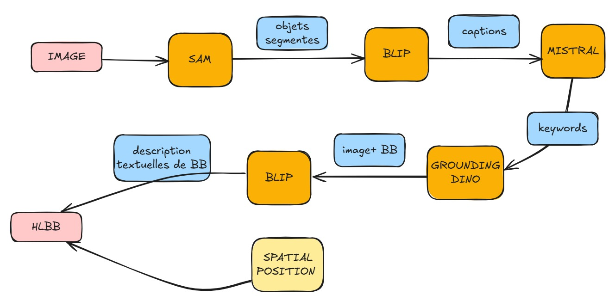
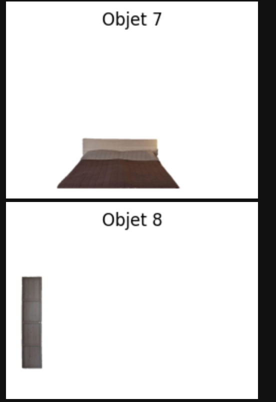
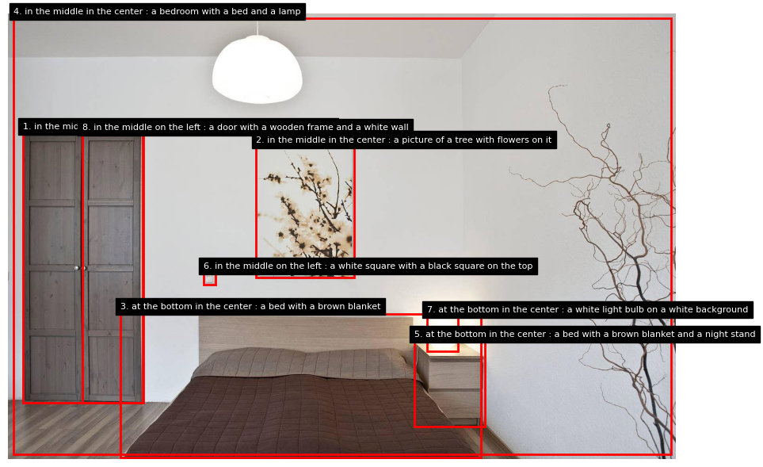

Segma Vision Pro SYNCHRONIZER 
=============================

**introduction à Segmentation Multi-Modal Intelligent**

Segma Vision Pro HLBB est un pipeline innovant de segmentation d'images qui combine quatre modèles d'IA de pointe dans un workflow séquentiel intelligent pour analyser, comprendre et segmenter des images avec une précision exceptionnelle.

Démonstration
-------------

.. list-table::
   :widths: 50 50
   :header-rows: 1

   * - Image d'entrée
     - Résultat final
   * - .. figure:: _static/images/input_image.jpg
          :width: 100%
          :alt: Image d'entrée
     - .. figure:: _static/images/output_result.jpg
          :width: 100%
          :alt: Résultat final

descption par BLIP :
a bedroom with a bed and a lamp on the wall, a wooden cabinet with doors, a white wall with some plants, a brown blanket on the bed, wooden floors, a white light hanging from ceiling, some artwork on wall,

Objectif du Projet
-------------------

Ce projet vise à créer un système de segmentation d'images qui peut :

* **Découvrir automatiquement** tous les objets d'une image (SAM)
* **Comprendre et décrire** le contenu de chaque région (BLIP)
* **Extraire intelligemment** les concepts clés (Mistral LLM)
* **Segmenter précisément** selon les classes détectées (Grounding DINO)
* **Enrichir quantitativement** chaque objet avec 61 caractéristiques (HLBB)

Technologies Utilisées
-----------------------

Le pipeline intègre quatre composants principaux dans un workflow séquentiel :

**SAM (Segment Anything Model)**
   Segmentation exploratoire qui découvre automatiquement tous les objets et régions de l'image.

**BLIP (Bootstrapping Language-Image Pre-training)**
   Analyse sémantique qui génère des descriptions détaillées pour chaque masque découvert.

**Mistral LLM**
   Traitement du langage naturel qui extrait et structure les mots-clés en classes utilisables.

**Grounding DINO**
   Détection ciblée qui segmente précisément l'image selon les classes extraites.

**HLBB Features (61 dimensions)**
   Extraction de caractéristiques quantitatives de haut niveau :
   
   * Histogramme couleur RGB (48 dimensions)
   * Analyse de texture LBP (10 dimensions) 
   * Caractéristiques géométriques (3 dimensions)

Workflow du Pipeline
--------------------
**pipeline**

   
   le pipeline qu'on a suivi 

Pipeline en 5 étapes
~~~~~~~~~~~~~~~~~~~~~

Input
~~~~~~~~~~~~
* Image d'entrée

**1. Segmentation Exploratoire (SAM)**
   * SAM génère automatiquement plusieurs masques de segmentation
   * Découverte de tous les objets et régions potentielles

    résulat:
**exemple de segmentation par SAM **

   
   résultat de SAM  

**2. Analyse Sémantique (BLIP)**
   * Chaque masque est analysé individuellement par BLIP
   * Génération de descriptions détaillées pour chaque région
   * Annotation automatique du contenu visuel

   résulat:
   
**exemple de masques annotés**

. list-table::
   :widths: 50 50
   :header-rows: 1

   * - Image 1
     - imaeg 2
   * - .. figure:: _static/images/bed.jpg
          :width: 100%
          :alt: Image 1
     - .. figure:: _static/images/image.jpg
          :width: 100%
          :alt: Image 2

**3. Extraction de Classes (Mistral LLM)**
   * Traitement des descriptions BLIP par le LLM Mistral
   * Extraction et structuration des mots-clés importants
   * Conversion en classes/prompts textuels utilisables

résulat: 
['chairs', 'wall mounted light', 'lamps', 'shelf', 'brown leather', 'bed', 'light switch plate', 'white circle', 'thermore', 'black and white floor lamp', 'door', 'small wooden object', 'flower', 'table', 'cabinet', 'white plastic plate', 'black and white photo', 'gold plate', 'wooden box', 'wall light', 'vase']

**4. Détection Ciblée (Grounding DINO)**
   * Utilisation des classes extraites comme prompts
   * Segmentation précise selon les objets détectés
   * Génération de bounding boxes optimisées

résulat:
**Image ségmentée**

   
   image résultante de grounding dino 

**5. Enrichissement HLBB**
   * Extraction de 61 caractéristiques quantitatives par objet
   * Analyse approfondie de couleur, texture et géométrie

résulat:
fichier JSON 

Output Final
~~~~~~~~~~~~

* Image segmentée avec bounding boxes précises
* Descriptions sémantiques détaillées (BLIP)
* Classes structurées (Mistral)
* Fichier JSON avec 61 caractéristiques par objet (HLBB)

Innovation du Pipeline
----------------------

Cette approche révolutionnaire combine :

* **Découverte exploratoire** : SAM trouve tout sans supervision
* **Compréhension sémantique** : BLIP comprend le contenu  
* **Intelligence linguistique** : Mistral structure l'information
* **Précision ciblée** : Grounding DINO affine la segmentation
* **Enrichissement quantitatif** : HLBB fournit 61 descripteurs

Le résultat est un système qui **découvre, comprend, structure, précise et enrichit** automatiquement le contenu visuel.

Applications
------------

* Analyse automatique de scènes complexes
* Annotation intelligente d'images
* Recherche par contenu visuel avancée
* Analyse d'images médicales ou satellitaires
* Système de description automatique d'images

